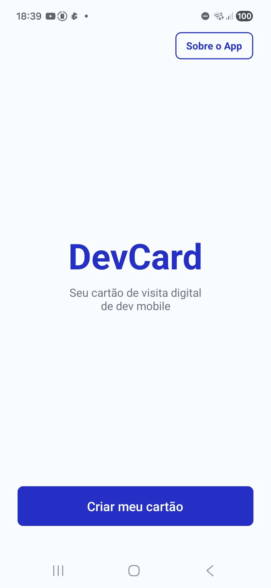
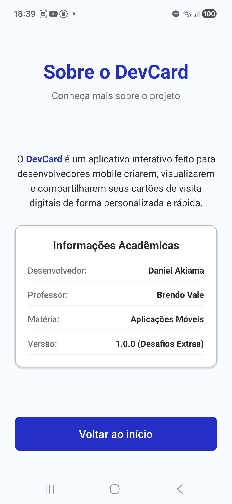
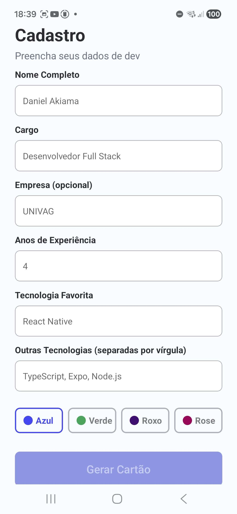
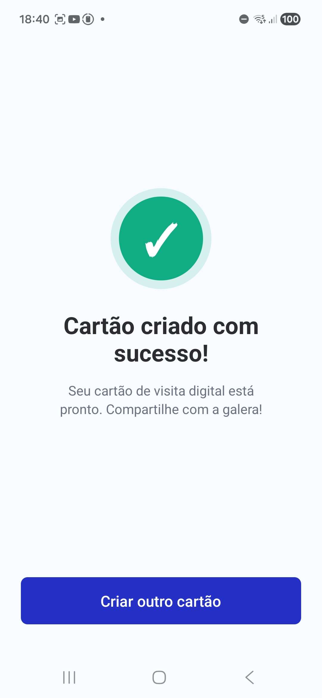

# 2º Instrumento Avaliativo - Aplicações Móveis
- **Professor:** Brendo Vale
- **Aluno:** Daniel Akiama
- **Turma:** SIS 2026/1
---
## Sobre o DevCard
Este aplicativo foi desenvolvido para a nota da IA2 de Aplicações Móveis. O **DevCard** funciona como um gerador simples de cartão de visita digital para desenvolvedores mobile. O usuário insere seus dados e o app gera um cartão estilizado com cores e nível profissional automático.
### O que o app faz:
- **Tela Inicial:** Boas-vindas e acesso à tela `/sobre` no cabeçalho (Desafio Extra).
- **Cadastro:** Formulário com validação de nome completo, cargo, experiência, tecnologia e cor do cartão.
- **Lista de tags (Desafio Extra):** Inclusão de outras tecnologias separadas por vírgula, renderizadas como etiquetas coloridas no cartão.
- **Visualização do Cartão:** Preview com a inicial do nome, nível técnico calculado (Júnior, Pleno ou Sênior) e cor selecionada.
- **Compartilhar (Desafio Extra):** Copia todos os dados formatados em texto para a área de transferência.
- **Sucesso:** Tela final de confirmação que limpa o histórico para criar um novo cartão.
### Tecnologias:
- React Native 
- Expo e Expo Router 
- TypeScript 
---
## Telas do Aplicativo
### 1. Boas-vindas (Index)

### 2. Sobre o App (Sobre)

### 3. Formulário de Cadastro (Cadastro)

### 4. Preview do Cartão (Preview)

### 5. Copiar e Compartilhar (Copia)

### 6. Confirmação de Sucesso (Sucesso)

